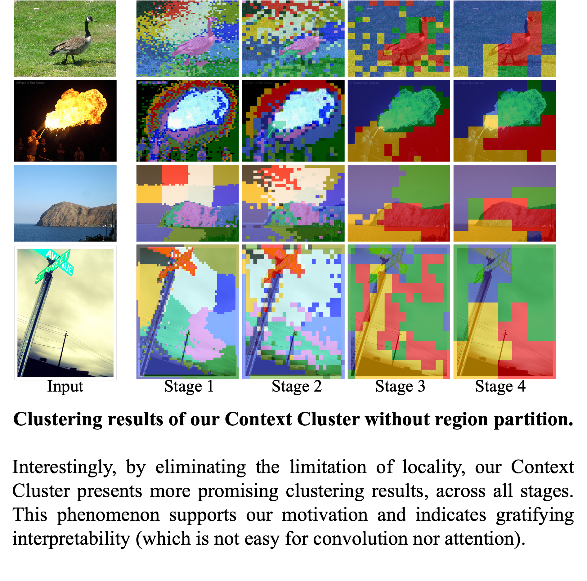

# Image as Set of Points - ICLR'23 [Oral]

by [Xu Ma*](https://ma-xu.github.io/), [Yuqian Zhou*](https://yzhouas.github.io/), 
[Huan Wang](http://huanwang.tech/), [Can Qin](https://canqin.tech/), [Bin Sun](https://www.linkedin.com/in/bin-sun-2993b4142/), 
[Chang Liu](https://sites.google.com/view/cliu5/home/), [Yun Fu](http://www1.ece.neu.edu/~yunfu/). 

[]() 
[](https://ma-xu.github.io/Context-Cluster/)
<!--
[](https://colab.research.google.com/drive/1s108WmqSVH9MILOjSAu29QyAEjExOWAP?usp=sharing), 
[](https://huggingface.co/spaces/CVPR/LIVE)
-->

<div align="center">
  
</div>

-----

<div align="center">
  
</div>


## Image Classification
### 1. Requirements

torch>=1.7.0; torchvision>=0.8.0; pyyaml; timm; [apex-amp](https://github.com/NVIDIA/apex) (if you want to use fp16);

data prepare: ImageNet with the following folder structure, you can extract ImageNet by this [script](https://gist.github.com/BIGBALLON/8a71d225eff18d88e469e6ea9b39cef4).

```
│imagenet/
├──train/
│  ├── n01440764
│  │   ├── n01440764_10026.JPEG
│  │   ├── n01440764_10027.JPEG
│  │   ├── ......
│  ├── ......
├──val/
│  ├── n01440764
│  │   ├── ILSVRC2012_val_00000293.JPEG
│  │   ├── ILSVRC2012_val_00002138.JPEG
│  │   ├── ......
│  ├── ......
```


### 2. Pre-trained Context Cluster Models
We upload the **checkpoints** and **logs** to anonymous google drive. Feel free to download.

| Model    |  #params | Image resolution | Top1 Acc| Throughtput | Download | 
| :---     |   :---:    |  :---: |  :---:  |  :---:  |:---:  |
| ContextCliuster-tiny  |    5.3M     |   224 |  71.8  |518.4| [[checkpoint & logs]](https://drive.google.com/drive/folders/1Q_6W3xKMX63aQOBaqiwX5y1fCj4hVOIA?usp=sharing) |
| ContextCliuster-tiny* |   5.3M     |   224 |  71.7  | 510.8| [[checkpoint & logs]](https://drive.google.com/drive/folders/1eod2CcYpLoPXmANUxT6dsNIHECbgAb0r?usp=sharing) |
| ContextCliuster-small  |   14.0M     |   224 |  77.5  |513.0| [[checkpoint & logs]](https://drive.google.com/drive/folders/1WSmnbSgy1I1HOTTTAQgOKEzXSvd3Kmh-?usp=sharing) |
| ContextCliuster-medium |   27.9M     |   224 |  81.0 |325.2| [[checkpoint & logs]](https://drive.google.com/drive/folders/1sPxnEHb2AHDD9bCQh6MA0I_-7EBrvlT5?usp=sharing) |


### 3. Validation

To evaluate our Context Cluster models, run:

```bash
MODEL=coc_tiny #{tiny, tiny2 small, medium}
python3 validate.py /path/to/imagenet  --model $MODEL -b 128 --checkpoint {/path/to/checkpoint} 
```


### 4. Train
We show how to train Context Cluster on 8 GPUs. The relation between learning rate and batch size is lr=bs/1024*1e-3.
For convenience, assuming the batch size is 1024, then the learning rate is set as 1e-3 (for batch size of 1024, setting the learning rate as 2e-3 sometimes sees better performance). 


```bash
MODEL=coc_tiny # coc variants
DROP_PATH=0.1 # drop path rates
python3 -m torch.distributed.launch --nproc_per_node=8 train.py --data_dir /dev/shm/imagenet --model $MODEL -b 128 --lr 1e-3 --drop-path $DROP_PATH --amp
```
**See folder [pointcloud](pointcloud/) for point cloud classification taks on ScanObjectNN.**

**See folder [detection](detection/) for Detection and instance segmentation tasks on COCO.**.

**See folder [segmentation](segmentation/) for Semantic Segmentation task on ADE20K.**


## BibTeX

    @inproceedings{ma2023image,
        title={Image as Set of Points},
        author={Xu Ma and Yuqian Zhou and Huan Wang and Can Qin and Bin Sun and Chang Liu and Yun Fu},
        booktitle={The Eleventh International Conference on Learning Representations},
        year={2023},
        url={https://openreview.net/forum?id=awnvqZja69}
    }
    

## Acknowledgment
Our implementation is mainly based on the following codebases. We gratefully thank the authors for their wonderful works.

[pointMLP](https://github.com/ma-xu/pointMLP-pytorch), [poolformer](https://github.com/sail-sg/poolformer), [pytorch-image-models](https://github.com/rwightman/pytorch-image-models), [mmdetection](https://github.com/open-mmlab/mmdetection), [mmsegmentation](https://github.com/open-mmlab/mmsegmentation).

## License
The majority of Context Cluster is licensed under an [Apache License 2.0](https://github.com/ma-xu/Context-Cluster/blob/main/LICENSE)
